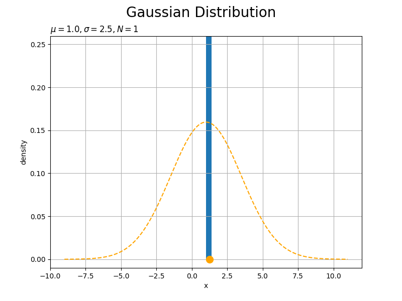

# ml_practice
This repository provides implementations for a better understanding of [PRML](https://www.microsoft.com/en-us/research/uploads/prod/2006/01/Bishop-Pattern-Recognition-and-Machine-Learning-2006.pdf)(Pattern Recognition and Machine Learning).

  

# [Probability distribution](https://github.com/Hiroaki-K4/ml_practice/tree/main/probability_distribution)

  

# [Linear regression model](https://github.com/Hiroaki-K4/ml_practice/tree/main/linear_regression_model)

  

# [Linear discriminative model](https://github.com/Hiroaki-K4/PRML/tree/main/linear_discriminative_model)

  

# Reference
- [Pattern Recognition and Machine Learning](https://www.microsoft.com/en-us/research/uploads/prod/2006/01/Bishop-Pattern-Recognition-and-Machine-Learning-2006.pdf)
