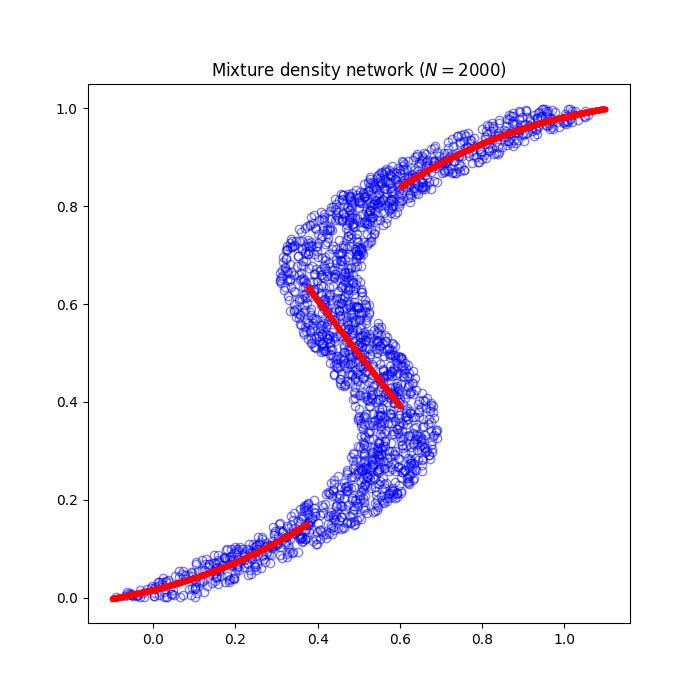

# ml_practice
This repository provides implementations for a better understanding of [PRML](https://www.microsoft.com/en-us/research/uploads/prod/2006/01/Bishop-Pattern-Recognition-and-Machine-Learning-2006.pdf)(Pattern Recognition and Machine Learning).

## Related articles I wrote
- [Fitting Trigonometric Functions Using the Nadaraya-Watson Model](https://medium.com/@hirok4/fitting-trigonometric-functions-using-the-nadaraya-watson-model-4483aaaaa339)
- [Implementing Mixture Density Network(MDN) Using Pytorch](https://medium.com/@hirok4/implementing-mixture-density-network-mdn-using-pytorch-8340c9530872)
- [Understanding the Tanh Function as an Activation Function](https://medium.com/@hirok4/understanding-the-tanh-function-as-an-activation-function-ff01dc3c9777)
- [Implementation of Stochastic Generative Model](https://medium.com/@hirok4/implementation-of-stochastic-generative-model-66d7ec44e557)
- [Implementing Fisher’s Linear Discriminant](https://medium.com/@hirok4/implementing-fishers-linear-discriminant-4b4c9829f7de)
- [Hyperparameter Estimation Using Evidence Approximation](https://medium.com/@hirok4/hyperparameter-estimation-using-evidence-approximation-7881f220470e)
- [Plotting Equivalent Kernel](https://medium.com/@hirok4/plotting-equivalent-kernel-bc59eb3c6d29)
- [Plotting Predicted Distribution of Bayesian Linear Regression Model](https://medium.com/@hirok4/plotting-predicted-distribution-of-bayesian-linear-regression-model-cd9380fba50b)
- [Plotting the Distribution of Parameters in Bayesian Linear Regression](https://medium.com/@hirok4/plotting-the-distribution-of-parameters-in-bayesian-linear-regression-895fc8eb638f)
- [Plotting Relationship between Bias and Variance](https://medium.com/@hirok4/plotting-relationship-between-bias-and-variance-cfc1415828be)
- [Plotting Basis Functions](https://medium.com/@hirok4/plotting-basis-functions-c273f7189217)
- [Plotting Polynomial Curve Fitting](https://medium.com/@hirok4/plotting-polynomial-curve-fitting-def32f646b13)
- [Plotting Mixture of Gaussians](https://medium.com/@hirok4/plotting-mixture-of-gaussians-ab7a0c114f8d)
- [Plotting von Mises Distribution](https://medium.com/@hirok4/plotting-von-mises-distribution-999795fac336)
- [Plotting Student’s t-distribusion](https://medium.com/@hirok4/plotting-students-t-distribusion-ee80150e134d)
- [Bayesian Inference for the Mean of a Gaussian Distribution with Known Mean](https://medium.com/@hirok4/bayesian-inference-for-the-mean-of-a-gaussian-distribution-with-known-mean-b29c299a5bd7)
- [Bayesian Inference for the Mean of a Gaussian Distribution with Known Variance](https://medium.com/@hirok4/bayesian-inference-for-the-mean-of-a-gaussian-distribution-with-known-variance-9efa3a32647e)
- [Plotting Conditional Gaussian Distribution](https://medium.com/@hirok4/plotting-conditional-gaussian-distribution-85be6e9ac208)
- [Plotting Gaussian Distribution](https://medium.com/@hirok4/plotting-gaussian-distribution-48320f53ac7c)
- [Plotting Probability Distributions for Binary and Multivalued Variables](https://medium.com/@hirok4/plotting-probability-distributions-for-binary-and-multivalued-variables-72d9e69d7c8e)

  

# [Probability distribution](https://github.com/Hiroaki-K4/ml_practice/tree/main/probability_distribution)

  

# [Linear regression model](https://github.com/Hiroaki-K4/ml_practice/tree/main/linear_regression_model)

  

# [Linear discriminative model](https://github.com/Hiroaki-K4/PRML/tree/main/linear_discriminative_model)

  

# [Neural network](https://github.com/Hiroaki-K4/PRML/tree/main/neural_network)

  

# Reference
- [Pattern Recognition and Machine Learning](https://www.microsoft.com/en-us/research/uploads/prod/2006/01/Bishop-Pattern-Recognition-and-Machine-Learning-2006.pdf)
