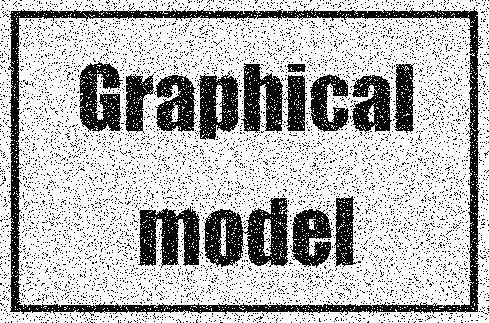

# Graphical model
It is very useful to use the probabilistic graphical model, which are graphical representations of probability distributions, in the analysis. The graph consists of a collection of **vertexes** connected by **edges**. In the probabilistic graphical model, each vertex represents the stochastic variable and each edge represents stochastic relationships between these parameters.
Directed graph whose edges have a specific direction is useful to represent the causal relationship between stochastic variables. Undirected graph is useful to represent the loose bondage relationship between stochastic variables.

<br></br>

# Image denoising
We perform image denoising using undirected graph. Suppose that an observed image containing noise is described as a $2$-dimensional array of binary pixel values $y_i\in \left\lbrace-1,+1 \right\rbrace$. Here, $i=1,...,D$ is the pixel serial number. This observed image is assumed to be obtained by randomly inverting the sign of a pixel with some small probability from a noiseless binary image described by $x_i\in \left\lbrace-1,+1 \right\rbrace$.
The below image is a noise added image obtained by inverting the sign of a pixel with a 10% probability. Our goal is to recover the original noiseless image from this noise-added image.



Original image is here.


The noise level is sufficiently low that a strong correlation between $x_i$ and $y_i$ is expected to remain. Also, we know there is a strong correlation between adjacent pixel $x_i$ and $x_j$. These prior knowledge is represented by a Markov stochastic field model corresponding to the undirected graph shown in the lower image.


We want to create an energy function that expresses the correlation between variables in order to determine whether a pixel value should be $-1$ or $1$ when restoring to the original image. To express the correlation between $x_i$ and $y_i$, we use a very simple function of the form $-\eta x_i y_i$, where $\eta$ is a positive constant. This energy function has the desired effect of having low energy (high probability) when $x_i$ and $y_i$ have the same sign and high energy (low probability) when they have different signs.  
For adjacent pixels $\left\lbrace x_i, y_i \right\rbrace$, we also want the energy to be lower when the two pixel values have the same sign than when they have different signs. Therefore, we use the energy function $-\beta x_i x_j$. $\beta$ is a positive constant.  
A term $hx_i$ may be added as a function of the $i$-th pixel value $x_i$ in the noiseless image. This term has the effect of biasing the pixel values so that they are more likely to have a particular sign.  
In summary, the total energy function for this model is as follows.

$$
E(x,y)=h\sum_{i}x_i-\beta\sum_{\left\lbrace i, j \right\rbrace}x_ix_j-\eta\sum_{i}x_iy_i
$$

We recover the original image by using a simple repetition method called as **ICM; iterated conditional modes**. The procedure is as follows.

## 1. Initialize $x_i$
For example, we can initialize as $x_i=y_i$ for all $i$.

## 2. Pick one $x_i$ and calculate the total energey in the two possible states (-1 or 1) of $x_i$, keeping the values of the other variables fixed

## 3. Set $x_i$ to the one with the smaller energey

<br></br>

You can run the noise reduction by running following command. Parameters are set as $\beta=1.0, \eta=2.1, h=0$. Setting $h=0$ means that the prior probabilities of the two states taken by $x_i$ are equal.

```bash
python3 remove_noise_using_graphical_model.py
```

The denoised image is below.


<br></br>

# Reference
- [Pattern Recognition and Machine Learning](https://www.microsoft.com/en-us/research/uploads/prod/2006/01/Bishop-Pattern-Recognition-and-Machine-Learning-2006.pdf)
