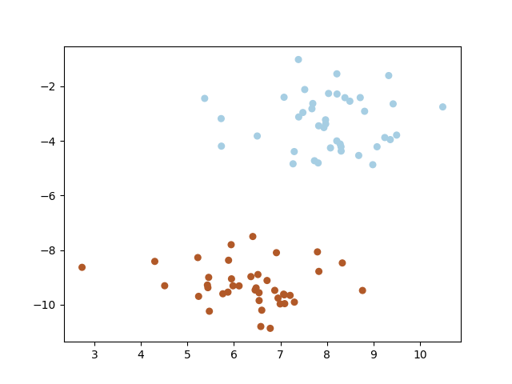

# Support vector machine
You can run **support vector machine** by running following command.

```bash
python3 svm.py
```



<br></br>

## Reference
- [Pattern Recognition and Machine Learning](https://www.microsoft.com/en-us/research/uploads/prod/2006/01/Bishop-Pattern-Recognition-and-Machine-Learning-2006.pdf)
