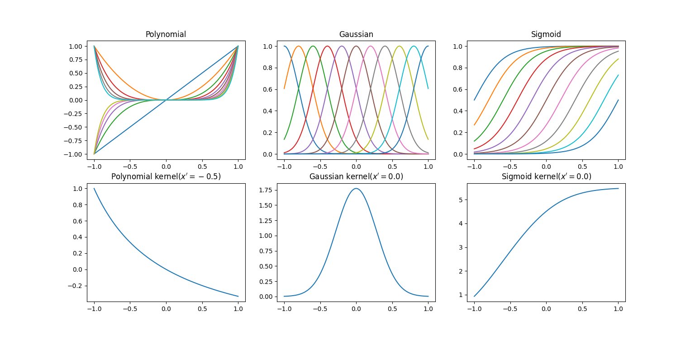

# Kernel method
Many parametric linear models can be rewritten in the form of an equivalent dual representation, prediction is also made by using kernel function defined with training data as the center. In a model based on a mapping $\phi(x)$ to a predefined nonlinear feature space, kernel function is given by following relationship.

$$
k(x,x\prime)= \phi(x)^\intercal \phi(x\prime) \tag{1}
$$

<!-- TODO  -->
<!-- Introduce various method with kernel method. -->


```bash
python3 draw_kernel_function.py
```



<br></br>

# References
- [Pattern Recognition and Machine Learning](https://www.microsoft.com/en-us/research/uploads/prod/2006/01/Bishop-Pattern-Recognition-and-Machine-Learning-2006.pdf)
