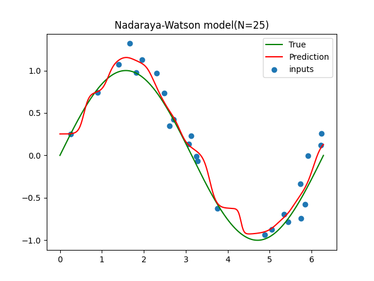
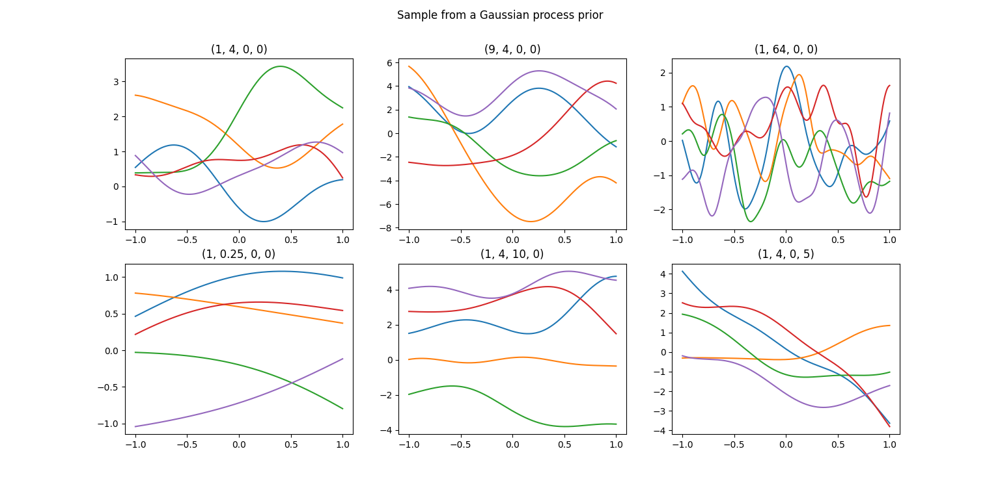
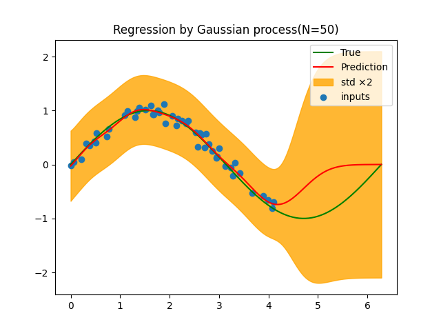

# Kernel method
Many parametric linear models can be rewritten in the form of an equivalent dual representation, prediction is also made by using kernel function defined with training data as the center. In a model based on a mapping $\phi(x)$ to a predefined nonlinear feature space, kernel function is given by following relationship.

$$
k(x,x\prime)= \phi(x)^\intercal \phi(x\prime) \tag{1}
$$

You can plot kernel functions by running following command.

```bash
python3 draw_kernel_function.py
```

Bottom row shows kernel function $k(x,x\prime)$. From the oeft, the plots show a polynomial function, a Guassian distribution, and a logistic sigmoid function.


<br></br>

# Nadaraya-Watson model
Kernel regression model can be motivated in terms of kernel density estimation. Let the training set be $(x_n, t_n)$, and to estimate the joint distribution $p(x,t)$, we use the Parzen windows density estimation as follows.

$$
p(x,t)=\frac{1}{N}\sum_{n=1}^N f(x-x_n, t-t_n) \tag{2}
$$

$f(x,t)$ is the density function that composes $p(x,t)$, one centered on each data point.
To calculate regression function $y(x)$, we need to calculate the conditional expectation of target variable conditioned on input variables, which is given by following equation.

$$
\begin{align*}
y(x)&=E[t|x]=\int_{-\infty}^{\infty} tp(t|x)dt \\
&=\frac{\int tp(x,t)dt}{\int p(x,t)dt} \\
&=\frac{\sum_{n} \int tp(x-x_n, t-t_n)dt}{\sum_{m} \int p(x-x_m, t-t_m)dt} \tag{3}
\end{align*}
$$

We can get the following equation by substituting variables.

$$
\begin{align*}
y(x)&=\frac{\sum_{n} g(x-x_n)t_n}{\sum_{m} g(x-x_m)} \\
&=\sum_{n} k(x, x_n)t_n \tag{4}
\end{align*}
$$

Here, $n,m=1,...,N$ and kernel function $k(x, x_n)$ is given by following equation.

$$
k(x, x_n)=\frac{g(x-x_n)}{\sum_{m} g(x-x_m)} \tag{5}
$$

And $g(x)$ is defined as follows.

$$
g(x)=\int_{-\infty}^{\infty} f(x,t)dt \tag{6}
$$

The result of Eq(3) is called as **Nadaraya-Watson model** or **Kernel regression**. If you use local kernel function, data points $x_n$ closer to data $x$ is are given more weight. Note that $k(x,x_n)$ is satisfied with sum constraint.

$$
\sum_{n=1}^N k(x,x_n)=1 \tag{7}
$$

You can try Nadaraya-Watson model by running following command.

```bash
python3 nadaraya_watson_model.py
```

Below graph shows Nadaraya-Watson model when isotropic Gaussin kernel is used for the trigonometric data. Each input data is the center of the isotropic Gaussian kernel.



<br></br>

# Gaussian process
In general, Gaussian process is defined as a probability distribution over the function $y(x)$, let the joint distribution of the values of $x_1,...,x_N$ for any set of points be obeyed by Gaussian distribution.
The important thing about Gaussian process is that **the joint distribution of N variables $y_1,...,y_N$ are completely described by statics up to second order, such as means and covariance.** In most applications, we have no a priori knowledge of the mean of $y(x)$, so by symmetry we often set it to $0$.

## Gaussian process regression
To apply Gaussian process to a regression problem, first, we need to think about the noise in the obeserved values of the target variable.

$$
t_n=y_n+\epsilon_n \tag{1}
$$

Here, $y_n=y(x_n)$, and $\epsilon_n$ is the noise added to the $n$-th observation. They are determined independently for each observation. Here, the noise is also obeyed by Gaussian distribution.

$$
p(t_n|y_n)=\mathcal{N}(t_n|y_n,\beta^{-1}) \tag{2}
$$

$\beta$ is a hyperparameter represents the precision of the noise. Since the noise is determined independently for each data point, the joint distribution of target value $t=(t_1,...,t_N)^\intercal$ is obeyed by the following isotropic distribution.

$$
p(t|y)=\mathcal{N}(t|y,\beta^{-1}I_N) \tag{3}
$$

Here, $I_N$ is an identity matrix. By the definition of Gaussian process, the marginal distribution $p(y)$ has Gaussian distribution with mean $0$ and covariance gram matrix $K$.

$$
p(y)=\mathcal{N}(y|0,K) \tag{4}
$$

Usually, kernel function to determine $K$ is determined to have property that **for two similar points $x_n$ and $x_m$, the corresponding points $y(x_n)$ and $y(x_m)$ have a high correlation.**

The merginal distribution of $t$ is found as follows.

$$
p(t)=\int p(t|y)p(y)dy=\mathcal{N}(t|0,C) \tag{5}
$$

Here, the covariance $C$ has following elements.

$$
C(x_n, x_m)=k(x_n, x_m)+\beta^{-1}\delta_{nm} \tag{6}
$$

This result is based on **the fact that probability variables $y(x)$ and $\epsilon$ correspond to two Gaussian distribution are independent of each other, the covariances can then simply be added together.**  
Exponential of quadratic coefficient plus a constant and a linear term are used as kernel function used for Gaussian process.

$$
k(x_n, x_m)=\theta_0 exp \Bigl( -\frac{\theta_1}{2}|x_n-x_m|^2 \Bigr) + \theta_2 + \theta_3 x_n^\intercal x_m \tag{7}
$$

The figure blow shows a plot of the sample from prior distribution with various parameters. You can plot the below graph by running the following command.

```bash
python3 draw_sample_from_gaussian_process_prior.py
```



In regression, we need to predict the value of target variable for a new input when training dataset is given. When inputs $x_1,...,x_N$ and corresponding $t_N=(t_1,...,t_N)^\intercal$ are given, we want to predict the target value $t_{N+1}$ for the input vector $x_{N+1}$. For that purpose, **it becomes neccessary to obtain a predictive distribution $p(t_{N+1}|t_N)$.**  
We need to write down the joint distribution $p(t_{N+1})$ to get the conditional distribution $p(t_{N+1}|t)$. From Eq(5), the joint distribution of $t_1,...,t_{N+1}$ is given as follows.

$$
p(t_{N+1})=\mathcal{N}(t_{N+1}|0,C_{N+1}) \tag{8}
$$

Here, $C_{N+1}$ is $(N+1) \times (N+1)$ covariance matrix and its elements are given by Eq(6). To get the conditional Gaussian distribution, we split the covariance matrix as follows.

$$
C_{N+1}=
\begin{pmatrix}
C_N & k \\
k^\intercal & c
\end{pmatrix} \tag{9}
$$

Here, $C_N$ is $N\times N$ covariance matrix whose elements are Eq(6), $k$ is the vector has elements $k(x_n,x_{N+1})(n=1,...,N)$. And scalar $c$ is $k(x_{N+1},x_{N+1})+\beta^{-1}$. By using Eq(10) and Eq(11), it can be seen that the conditional distribution $p(t_{N+1}|t)$ becomes the Gaussian distribution has following mean(Eq.12) and covariance(Eq.13). Eq(10) and Eq(11) are explained in deteil in the chapter 2 of [PRML](https://www.microsoft.com/en-us/research/uploads/prod/2006/01/Bishop-Pattern-Recognition-and-Machine-Learning-2006.pdf).

$$
u_{a|b}=u_a + \Sigma_{ab} \Sigma_{bb}^{-1}(x_b-u_b) \tag{10}
$$

$$
\Sigma_{a|b}=\Sigma_{aa} - \Sigma_{ab} \Sigma_{bb}^{-1} \Sigma_{ba} \tag{11}
$$

$$
m(x_{N+1})=k^\intercal C_N^{-1} t \tag{12}
$$

$$
\sigma^2(x_{N+1})=c-k^\intercal C_N^{-1}k \tag{13}
$$

Since the vector $k$ is the function of test input $x_{N+1}$, the mean and variance of the Gaussian distribution also depend on $x_{N+1}$.

You can try Gaussian process by running the following command.

```bash
python3 draw_gaussian_process.py
```



<br></br>

# References
- [Pattern Recognition and Machine Learning](https://www.microsoft.com/en-us/research/uploads/prod/2006/01/Bishop-Pattern-Recognition-and-Machine-Learning-2006.pdf)
- [Fundamentals of Gaussian Processes and Unsupervised Learning](https://www.ism.ac.jp/~daichi/lectures/H26-GaussianProcess/gp-lecture2-daichi.pdf)
