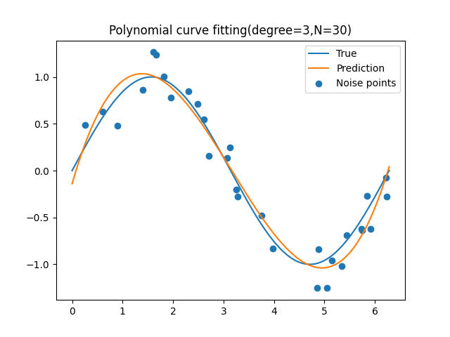

# Linear regression model
The goal of a regression problem is to predict the values of one or more target variables $t$ from the values of a given $D$-dimensional input variable vector $x$.
In its simplest form, a linear regression model is a function that is also linear with respect to the input variables. However, a much more useful class of functions is obtained by taking a linear combination of a fixed set of nonlinear functions with respect to the input variables, known as fixed basis functions. Models using basis functions are easy to analyze because they are linear with respect to parameters, and are also nonlinear with respect to input variables.

The goal of regression is to calculate the value of $t$ for a new $x$, given a training data set consisting of $N$ observed values ${x_n}(n=1,...,N)$ and corresponding target values ${t_n}$. The simplest approach is to directly construct a suitable function $y(x)$ such that the value for a new input $x$ is a prediction of the corresponding value of $t$. In a more general probabilistic view, the aim is to model a prediction distribution $p(t|x)$ to represent the uncertainty in the value of t for each value of $x$. Using this conditional distribution, we can predict $t$ for any new value of $x$ in a way that minimizes the expected value of an appropriately chosen loss function.

<br></br>

# Polynomial curve fitting
As a training set, $x=(x_1,...,x_N)^\intercal$, which is an arrangement of $N$ observed values $x$, and $t=(t_1,...,t_N)^\intercal$, which is an arrangement of the corresponding observation values $t$. Suppose it is given. Then, for the target data set $t$, first calculate the function value of $sin(2\pi x)$, then add random noise.
Here, we will use the following polynomial to fit the data.

$$
y(x,w)=w_0+w_1x+w_2x^2+...+w_Mx^M=\sum_{j=0}^Mw_jx^j \tag{1}
$$

$M$ is the degree of the polynomial. The polynomial coefficients $w_0,...,w_M$ are collectively written as a vector $w$.

Let's find the coefficient values by fitting a polynomial to the training data. This can be achieved by minimizing an error function that measures the deviation between the value of the function $y(x,w)$ and the data points of the training set when $w$ is arbitrarily fixed. A simple and widely used method for selecting an error function is the sum of squared error between the predicted value $y(x_n,w)$ at each data point $x_n$ and the corresponding target value $t_n$. If you write it as a formula, it will look like the following, and this will be minimized.

$$
E(w)=\frac{1}{2}\sum_{n=1}^N(y(x_n,w)-t_n)^2 \tag{2}
$$

Since the error function is a quadratic function of the coefficient $w$, the statement about that coefficient is linear with respect to the elements of $w$ and usually has only one solution that minimizes the error function.
By differentiating with respect to w and setting it to 0, we can derive the solution as follows.

$$
\begin{align*}
E'(w)=\sum_{n=1}^N\Bigl(\sum_{j=0}^Mw_jx_n^j-t_n\Bigr)x_n^i&=0 \\
\sum_{n=1}^N\sum_{j=0}^Mw_jx_n^{i+j}&=\sum_{n=1}^Nx_n^it_n \\
\sum_{j=0}^Mw_j&=A^{-1}T \tag{3}
\end{align*}
$$

However, somewhere along the way, I replaced $\sum_{n=1}^Nx_n^{i+j}$ with $A$ and $\sum_{n=1}^Nx_n^it_n$ with $T$.

We can try a polynomial curve fitting by running the follow command. You can edit a degree of the model.

```bash
python3 draw_polynomial_curve_fitting.py
```





It can be seen that if the order increases too much, overfitting occurs.

<br></br>

# Linear basis function model
The simplest linear regression model involves a linear combination of input variables.

$$
y(x,w)=w_0+w_1x_1+...+w_Dx_D \tag{4}
$$

An important property of this model is that it is a linear function with respect to the parameters $w_0,...,w_D$. However, since the input variable $x_i$ is also a linear function, it has poor expressive ability, which is a fatal problem with this model. Therefore, we expand this class of models by considering linear combinations of nonlinear functions with respect to input variables.

$$
y(x,w)=w_0+\sum_{j=1}^{M-1}w_j\phi_j(x) \tag{5}
$$

However, $\phi_j(x)$ is called basis function. If the maximum value of subscript $j$ is expressed as $M-1$, the number of parameters in this model is $M$.
The parameter $w_0$ allows for an arbitrary fixed amount of offset of the data and is sometimes called a bias parameter. It is often easier to handle by adding a dummy basis function $\phi_0(x)=1$ defined as follows.

$$
y(x,w)=\sum_{j=0}^{M-1}w_j\phi_j(x)=w^\intercal\phi(x) \tag{6}
$$

$w=(w_0,...,w_{M-1})^\intercal$ and $\phi=(\phi_0,...,\phi_{M-1})^\intercal$.
By using nonlinear basis functions, the function $y(x,w)$ becomes a nonlinear function with respect to the input vector $x$. However, since it is linear with respect to the parameter $w$, the function expressed in the form of Eq(5) is called a linear model. Due to the linearity with respect to the parameters, the behavior of this class of models can be analyzed very easily.

Basis functions include polynomials, Gaussian basis functions, and sigmoid basis functions. The sigmoid function is expressed as follows.

$$
\begin{align*}
\phi_j(x)&=\sigma\Bigl(\frac{x-\mu_j}{s}\Bigr) \\
\sigma(a)&=\frac{1}{1+exp(-a)} \tag{7}
\end{align*}
$$

We can draw basis functions by running following command.

```bash
python3 draw_basis_functions.py
```


<br></br>

# Regularized least squares method
We add a regularization term to the error function to prevent overfitting. The error function can be written as follows.

$$
\frac{1}{2} \sum_{n=1}^{N} (t_n-w^\intercal\phi(x))^2 + \frac{\lambda}{2}w^\intercal w \tag{8}
$$

$\lambda$ is a regularization coefficient to control relative importance between the error and the regularization term.
The choice of this regularization term is called as **weight decay** in the field of machine learning. Because weights, which are not needed by the sequential learning algorithm, approach $0$.

Set the gradient of $w$ in Eq(8) to $0$ and solve for w, we can get following equation.

$$
w=(\lambda I + \Phi^\intercal\Phi)^{-1}\Phi^\intercal t \tag{9}
$$

$\Phi$ is called as **design matrix** and can be written as follows. $\phi$ is a basis function.

$$
\Phi=
\begin{pmatrix}
\phi_0(x_1) & \phi_1(x_1) & ... & \phi_{M-1}(x_1) \\
\phi_0(x_2) & \phi_1(x_2) & ... & \phi_{M-1}(x_2) \\
... & ... & ... & ... \\
\phi_0(x_N) & \phi_1(x_N) & ... & \phi_{M-1}(x_N) \\
\end{pmatrix} \tag{10}
$$

<br></br>

# Bias-variance decomposition
If you train a complicated model with a small training data, the model may overfitting. However, limit the number of basis functions to avoid overfitting, the expression of model is restricted. If you add a regularization term, overfitting can be prevented, but it is difficult to decide an appropriate $\lambda$.  
Let's think about the complexity of model known as the trade-off of **bias-variance**. In the decision theory, the standard error function is squared error function, and best precision is give as the conditional expectation value.

$$
h(x)=E[t|x]=\int tp(t|x)dt \tag{11}
$$

Also, the expected squared loss can be written as follows.

$$
E[L]=\int(y(x)-h(x))^2 p(x)dx + \int\int(h(x)-t)^2 p(x,t)dxdt \tag{12}
$$

The second term is independent of $y(x)$, depends on the noise of data and represents the achievable minimum expectation error. The first term depends on $y(x)$, so we need to calculate y(x) minimize this term.

Now consider the integral of the first term in Eq(12). This can be written as follows in a certain dataset $D$.

$$
(y(x;D)-h(x))^2 \tag{13}
$$

Because this amount depends on dataset $D$, think about the expectations for how this dataset $D$ is taken. The following equation is obtained by using $E_D[y(x;D)]$.

$$
(y(x;D)-E_D[y(x;D)] + E_D[y(x;D)] - h(x))^2 \\
=(y(x;D)-E_D[y(x;D)])^2+(E_D[y(x;D)] - h(x))^2 \\
+ 2(y(x;D)-E_D[y(x;D)])(E_D[y(x;D)] - h(x)) \tag{14}
$$

The final term disapppears by getting expectations how dataset $D$ is taken.

$$
E_D[(y(x;D)-h(x))^2]=(E_D[y(x;D)] - h(x))^2 + E_D[(y(x;D)-E_D[y(x;D)])^2] \tag{15}
$$

The first term is called a **squared bias**, represents the distance between the average of predictions and the ideal regression function. The second term is called **variance**, represents the distance between predictions and the expectations how dataset is taken.

we can write the expected squared loss can be written as follows.

$$
\begin{align*}
ExpectedLoss&=Bias^2+Variance+Noise \tag{16} \\
Bias^2&=\int(E_D[y(x;D)] - h(x))^2 p(x)dx \tag{17} \\
Variance&=\int E_D[(y(x;D)-E_D[y(x;D)])^2] p(x)dx \tag{18} \\
Noise&=\int\int(h(x)-t)^2 p(x,t)dxdt \tag{19}
\end{align*}
$$

The purpose of training is to minimize the expected loss. Flexible and complicated model has a small bias but a large variance. On the other hand, less flexible model has a large bias but a small variance. Therefore, the model reduce bias and variance in a well-balanced manner is an optimal model.

We will show it by using trigonometric functions. Here, generate $L=100$ datasets with $N=25$ points  by using a trigonometric function $h(x)=sin(2\pi x)$
Optimize $24$ gauss basis functions to minimize Eq(8). Top row graph corresponds to a large regularization coefficient $\lambda$. In this case, variance(left graph) is small but bias(right graph) is large. On the other hand, the bottom graph corresponds to a small regularization coefficient $\lambda$. In this case, variance(left graph) is large but bias(right graph) is small. The prediction at right graph is averaged by $100$ predictions.


You can draw above graph by running following command.

```bash
python3 draw_bias_variance_decomposition.py
```

<br></br>

# Bayesian linear regression
We demonstrate how avoid overfitting of most likelihood estimation and decide the complexity of the model from only training data.

## Distribution of parameters
Here, we explain about Bayesian treatment of linear regression model by introducing the prior probability distribution of model parameter $w$. Prior distribution can be written as follows $m_0$ is the expected value and $S_0$ is the convariance.

$$
p(w)=\mathcal{N}(w|m_0,S_0) \tag{20}
$$

The likelihood function becomes as follows. $\phi$ is the basis function and $\beta$ is the precision.

$$
p(t|X,w,\beta)=\prod_{n=1}^N \mathcal{N}(t_n|w^\intercal \phi(x_n), \beta^{-1}) \tag{21}
$$

Next, the posterior distribution is propotional to the product of the likelihood function and the prior distribution.

$$
p(w|t)\propto p(t|X,w,\beta) \times p(w) \tag{22}
$$

We describe the Bayesian learning and how to update the posterior distribution by using a simple example about linear fitting. We use simple linear model $y(x,w)=w_0+w_1x$, so we can plot the prior distribution and the posterior distribution of parameters to the paramter space.

To create the correct label value $t_n$, we choose $x_n$ from the uniform distribution and evaluate $f(x,a)=a_0+a_1x(a_0=-0.3,a_1=0.5)$. Gauss noise (std=0.2) is added to $t_n$.

The purpose is to recover true parameter $a_0$ and $a_1$ and to find the relationship between data size and prediction value. The below graph shows the result and sequentiality of Bayesian learning. 


The figure in the first row shows the situation before any data is observed. The second graph represents the situation after observing one data point. The right graph shows the position of data $(x,t)$ by a blue point. The left graph shows the likelihood function $p(t|x,w)$ as a function of $w$. It represents a soft constraint that a line should pass near this data point.
White point is true parameter value($a_0=-0.3,a_1=0.5$). Middle graph is obtained by multiplying the likelihood function and the prior distribution and normalizing it. Right graph shows observed points(blue) and the regression function chosen randomly from the posterior distribution of $w$. You can see that as the number of data points increases, the lines become more coherent. Posterior distribution becomes prior distribution of next row.
It can be seen that the posterior distribution becomes sharper as the amount of data increases.

You can draw above graph by running following command.

```bash
python3 draw_sequential_bayesian_learning.py
```

## Predicted distribution
So far we have talked about $w$ value, there are many cases that we want predict $t$ for a new $x$ in pratical situations. We need to evaluate **predicted distribution** defined as follows.

$$
p(t|x,t,\alpha, \beta)=\int p(t|x,w,\beta) p(w|x,t,\alpha,\beta)dw \tag{23}
$$

$t$ is a vector consisting of label value of training data. Predicted distribution can be rewritten as follows after convolving the two normal distiributions.

$$
p(t|x,t,\alpha,\beta)=\mathcal{N}(t|m_N^\intercal \phi(x),\sigma_N^2(x)) \tag{24}
$$

Variance of predicted distribution is given as follows.

$$
\sigma_N^2(x)=\frac{1}{\beta} + \phi(x)^\intercal S_N \phi(x) \tag{25}
$$

$m_N$ and $S_N$ are given as follows.

$$
\begin{align*}
m_N&=S_N(S_0^{-1}m_0+\beta\Phi^\intercal t) \\
S_N^{-1}&=S_0^{-1}+\beta\Phi^\intercal \Phi \tag{26}
\end{align*}
$$

$\Phi$ is design matrix and $\phi$ is basis function.

The first term of Eq(25) represents a noise of data, the second term represents uncertainty of $w$. If a new data point is added, posterior distribution becomes narrower. That is, $\sigma_{N+1}^2(x) \leq \sigma_N^2(x)$ holds true.

We use dataset of trigonometric function for showing an example of predicted distribution of Bayesian linear regression model. The below graph shows distribution at fitting model with gauss basis functions to training data of various sizes. Blue line shows $sin(2\pi x)$ function. Input data is generated from this function and added Gaussian noise. Blue points represent input data points. Red line shows the mean of Gaussian predicted distribution and orange area represents $mean\pm variance$. As the number of data points increases, the degree of uncertainty decreases.


You can draw above graph by running following command.

```bash
python3 draw_predicted_distribution.py
```

## Equivalent kernel


```bash
python3 draw_equivalent_kernel.py
```

<br></br>

# Reference
- [Pattern Recognition and Machine Learning](https://www.microsoft.com/en-us/research/uploads/prod/2006/01/Bishop-Pattern-Recognition-and-Machine-Learning-2006.pdf)
