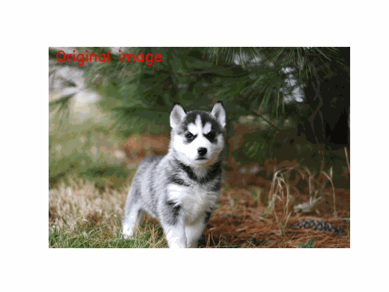

# Mixed models and EM

# K-means clustering
K-means is a non-hierarchical method, an algorithm that divides the given data into $K$ clusters. Each cluster is grouped so that similar points in the data come together, and the center of each cluster is calculated as the **"mean"** of the cluster. This technique is used to find patterns in the data or to analyze its distribution.

## Image segmentation using K-means algorithm
As an exmaple of a real-world application of the K-means algorithm, let's apply it to image segmentation. The goal of image segmentation is to divide a single image into multiple regions of reasonably homogeneous appearance.
Here we consider an image segmentation algorithm that simply treats each pixel in the image as a single data point. The algorithm applied in this case is as follows.

### Algorithm
#### 1. Select $K$ initial cluster center RGB values
First, we randomly select $K$ RGB values and set them as the cluster centers, where $K$ is a pre-set parameter that specifies how many clusters to divide into.


#### 2. Assign each pixel to the nearest cluster center
For each pixel, the distance to the center of each cluster is calculated and the pixel is assgined to the nearest center. This classifies the data in to $K$ clusters.

#### 3. Cluster center recalculation
Calculate the average of the pixels belonging to each cluster and set it as the center of the new cluster.

#### Repeat (until convergence)
The above process(step2 and step3) is repeated until the position of the centers remains approximately the same. This is convergence. Eventually, all data points will belong to the nearest cluster of centroids.

Specific implementation of these processes are as follows.

```python
def segment_image_by_kmeans(input_img, k):
    # Create random initial means (cluster centroids)
    u_k = np.random.randint(0, 256, size=(k, 3))

    # Reshape the input image to a 2D array where each row is a pixel (R, G, B)
    pixels = input_img.reshape(-1, 3)

    # Prepare an array to store the assigned cluster for each pixel
    class_arr = np.zeros(pixels.shape[0], dtype=int)

    # Iterate until convergence (in this version, just perform one iteration)
    for _ in range(10):
        # Compute the squared Euclidean distance from each pixel to each cluster center
        distances = np.sqrt(((pixels[:, np.newaxis] - u_k) ** 2).sum(axis=2))

        # Assign each pixel to the nearest cluster
        class_arr = np.argmin(distances, axis=1)

        old_u_k = np.copy(u_k)
        # Recalculate the new means for each cluster
        for i in range(k):
            if np.any(class_arr == i):
                u_k[i] = pixels[class_arr == i].mean(axis=0)

        if np.array_equal(old_u_k, u_k):
            break

    # Reshape the class_arr back to the original image shape
    result_label = class_arr.reshape(input_img.shape[:2])

    # Create result image
    segmented_img = create_segmented_image(result_label, u_k)

    return segmented_img
```

You can try image segmentation by K-means by running following command.

```bash
python3 image_segmentation_by_k-means.py
```

$k$ means the number of clusters.



The K-means algorithm is a very simple method, but it has the drawback that it is difficult to determine the appropriate value of $K$, and poor initial values can result in poor accuracy.  
As we all know, neural network-based methods are the norm now, but I still think the underlying algorithms are also important.

<br></br>

# Reference
- [Pattern Recognition and Machine Learning](https://www.microsoft.com/en-us/research/uploads/prod/2006/01/Bishop-Pattern-Recognition-and-Machine-Learning-2006.pdf)
