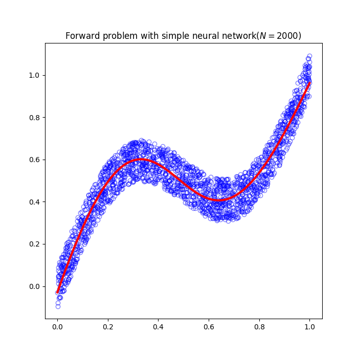
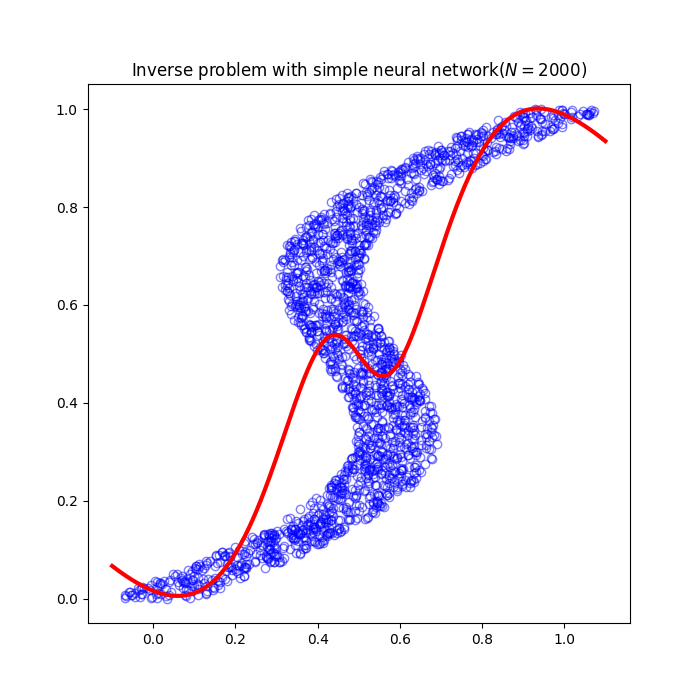
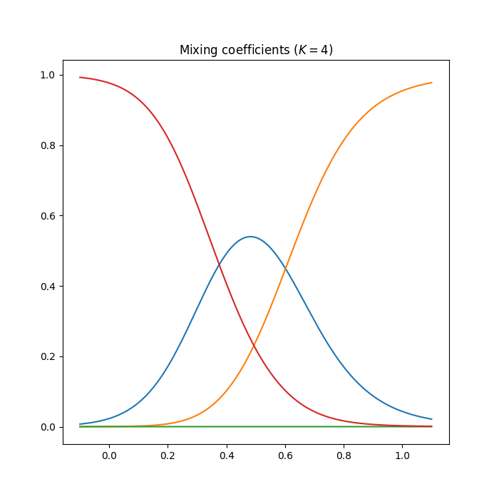
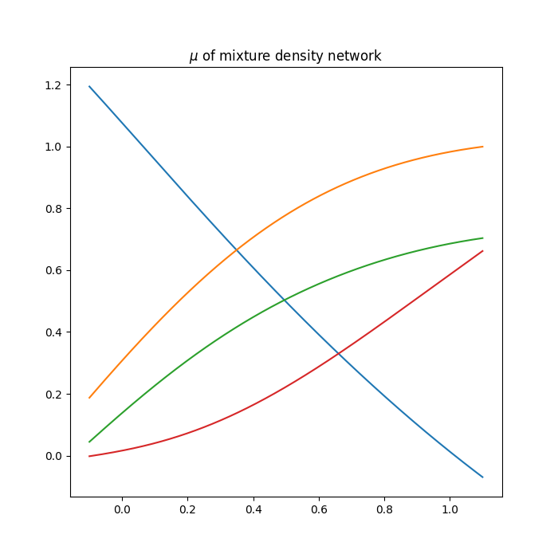
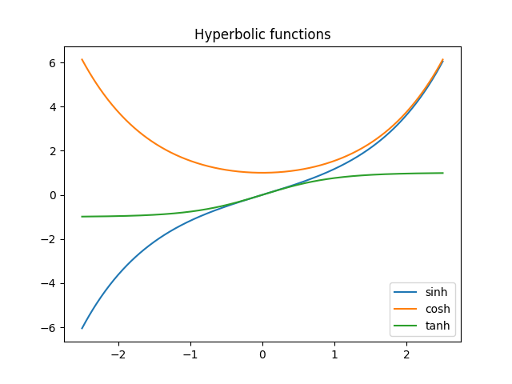
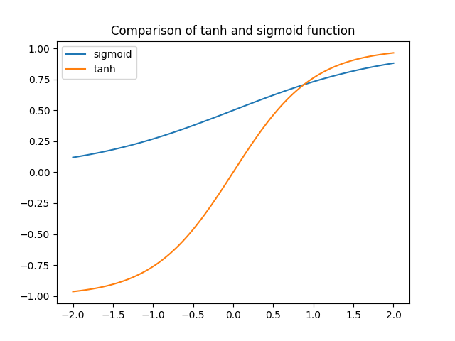

# Neural network

<br></br>

# Mixture density network
The goal of surpervised learning is to model conditional probability $p(t|x)$, it is assumed that it is Gaussin distribution in many simple regression problems. However, in practical machine learning problem, we often have to use a completely different distribution from Gaussian distribution. For example, this appears in **inverse problems** where the distribution may be multimodal. In this case, under the assumption of Gaussian distribution, sometimes you only get a weak estimation.

This time, let's consider an easy problem that allows us to visualize multimodality. Let $x_n$ be the random value $x$ that is uniformly distributed in the interval $(0,1)$, and the corresponding target value $t_n$ is generated by adding a uniform random number in the interval $(-0.1,0.1)$ to the function $x_n+0.3sin(2\pi x_n)$. By swapping the roles of $x$ and $t$ for this same data, we obtain the inverse problem.

We can get the good result of forward problem by using a simple neural network.

```bash
python3 solve_forward_problem.py
```



</br>

However, it is difficult to get a good result in the inverse problem.

```bash
python3 solve_inverse_problem_with_simple_network.py
```



</br>

So we should use a different network to solve the inverse problem. In this case, we use the **mixture density network**. It provides a general framework to model any conditional probability function $p(t|x)$. Let's build the model when it has gaussian distributions as elements. That is, consider the following model.

$$
p(t|x)=\sum_{k=1}^K \pi_k(x) \mathcal{N}(t|\mu_k(x), \sigma_k^2(x)I) \tag{1}
$$

$\pi_k$ is **mixing coefficients** and they should satisfy following constraints.

$$
\sum_{k=1}^K \pi_k(x)=1, \quad 0 \leq \pi_k(x) \leq 1 \tag{2}
$$

This is obtained by using softmax function.

$$
\pi_k(x)=\frac{exp(a_k^\pi)}{\sum_{l=1}^K exp(a_l^\pi)} \tag{3}
$$

Similarly, variace should satisfy $\sigma_k^2(x) \geq 0$ and it is obtained by using the exponential function of corresponding network output.

$$
\sigma_k(x)=exp(a_k^\sigma) \tag{4}
$$

Finally, since the mean $u_k(x)$ has real elements, we can use the output of network directly.

$$
u_{kj}(x)=a_{kj}^\mu \tag{5}
$$

The adaptive parameters of mixture density network are weights and bias of nueral network. These are optimized by the following error function.

$$
E(w)=-\sum_{n=1}^N log \Bigl(\sum_{k=1}^K \pi_k(x_n,w)\mathcal{N}(t_n|u_k(x_n,w),\sigma_k^2(x_n,w)I)\Bigr) \tag{6}
$$

We use tanh sigmoid function as hidden units. In the prediction, we use the mean of max mixing coefficient as estimated value.

In the following graph, red points represent the result of prediction. We can understand the power of mixture density network for inverse problem.

```bash
python3 solve_inverse_problem_with_mixture_density_network.py
```


</br>

The below graph shows the values of mixing coefficients. It can be seen that both ends of $x$ are unimodal and the middle is multimodal.



</br>

The mean values are plotted using the same colors as for the mixing coefficients.



<br></br>

# Appendix
## Tanh sigmoid function
Tanh sigmoid function is sometimes used as activation function of machine learning. It is one of hyperbolic functions.

$$
tanh(x)=\frac{e^x-e^{-x}}{e^x+e^{-x}}
$$

### Hyperbolic functions
In mathematics, hyperbolic functions are analogues of the ordinary trigonometric functions, but defined using the hyperbola rather than the circle. Just as the points $(cos t, sin t)$ form a circle with a unit radius, the points $(cosh t, sinh t)$ form the right half of the unit hyperbola. Also, similarly to how the derivatives of $sin(t)$ and $cos(t)$ are $cos(t)$ and $–sin(t)$ respectively, the derivatives of $sinh(t)$ and $cosh(t)$ are $cosh(t)$ and $+sinh(t)$ respectively.

$$
sinh(x)=\frac{e^x-e^{-x}}{2}, \quad cosh(x)=\frac{e^x+e^{-x}}{2}, \quad tanh(x)=\frac{sinh(x)}{cosh(x)}=\frac{e^x-e^{-x}}{e^x+e^{-x}}
$$

You can draw hyperbolic functions by running following command.

```bash
python3 draw_hyperbolic_functions.py
```



### Derivatives
Derivatives of hyperbolic functions are as follows.

$$
\begin{align*}
\frac{d}{dx}sinhx&=\frac{e^x+e^{-x}}{2}=cosh(x) \\
\frac{d}{dx}coshx&=\frac{e^x-e^{-x}}{2}=sinh(x) \\
\frac{d}{dx}tanhx&=\frac{d}{dx}\frac{sinh(x)}{cosh(x)}=\frac{cosh^2(x)-sinh^2(x)}{cosh^2(x)}=1-tanh^2(x) \\
\end{align*}
$$

### Comparison of tanh sigmod and sigmoid
Both tanh function and sigmoid function are S-shaped curve function, but while tanh function is a symmetrical S-shaped curve at the origin $(0, 0)$, sigmoid function is a symmetrical S-shaped curve at $(x,y)=(0,0.5)$. Furthermore, it is known that it is desirable for activation function to be symmetrical at the origin.

You can compare tanh and sigmoid function by running following command.

```bash
python3 compare_tanh_sigmoid_and_sigmoid.py
```



<br></br>

# References
- [Pattern Recognition and Machine Learning](https://www.microsoft.com/en-us/research/uploads/prod/2006/01/Bishop-Pattern-Recognition-and-Machine-Learning-2006.pdf)
- [Hyperbolic functions](https://en.wikipedia.org/wiki/Hyperbolic_functions)
- [Mixture Density Networks](https://github.com/dusenberrymw/mixture-density-networks)
