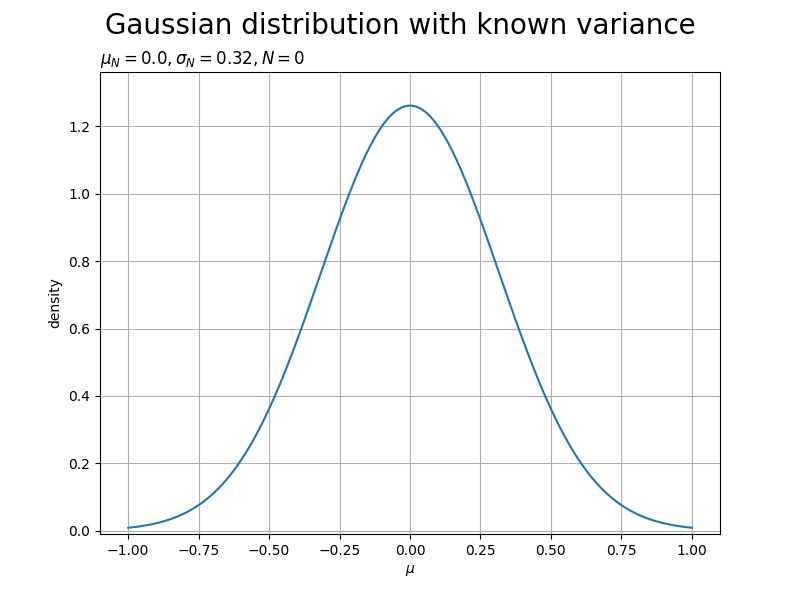

# Probability distribution
Probability theory is important in solving pattern recognition problems. Here we summarize various probability distributions and their characteristics.

<br></br>

# Binary variable
Let us first consider the case where there is a single binary random variable $x\in{0,1}$. For example, if $x=1$ represents a table and $x=0$ represents a flip, the result of the coin toss is represented by this binary random variable $x$. The probability that $x=1$ is represented by the parameter $\mu$, where $\mu$ is the probability that the coin is skewed.

$$
p(x=1|\mu)=\mu \tag{1}
$$

However, $0\leq\mu\leq1$, from which $p(x=0|\mu)=1-\mu$. Therefore, the probability distribution on $x$ is as follows.

$$
Bern(x|\mu)=\mu^x (1-\mu)^{1-x} \tag{2}
$$

This is known as the Bernoulli distribution. The mean and variance of this distribution are as follows

$$
\begin{align*}
E[x]&=\mu \\
var[x]&=\mu(1-\mu) \tag{3}
\end{align*}
$$

## Binomial distribution
The distribution of the number $m$ of observations for a given data set of size $N$, where $x=1$, is called the binomial distribution. To calculate the normalization factor, we consider the sum over all possible cases where $N$ coin tosses produce the table $m$ times, the binomial distribution is as follows. Denote the probability that x=1 by $\mu$.

$$
Bin(m|N,\mu)=\frac{N!}{(N-m)!m!}\mu ^m (1-\mu) ^{N-m} \tag{4}
$$

The mean and variance are as follows.

$$
\begin{align*}
E[m]&=\sum_{m=0}^N mBin(m|N,\mu)=N\mu \\
var[m]&=\sum_{m=0}^N (m-E[m])^2 Bin(m|N,\mu) = N\mu(1-\mu) \tag{5}
\end{align*}
$$

You can draw the binomial distribution by running follow command.

```bash
python3 draw_binomial_distribution.py
```

The graph shows the results for varying values of $\mu$.


<br></br>

## Beta distribution
The maximum likelihood estimate of the parameter $\mu$ of the binomial distribution is the fraction of observations in the data set for which $x=1$. But this method can be very over fitting when the data set is small. Therefore, it is necessary to introduce a prior distribution of the parameter $\mu$ in order to treat this problem in a Bayesian manner. The following beta distribution is chosen as the prior distribution.

$$
Beta(\mu|a,b)=\frac{\gamma(a+b)}{\gamma(a)\gamma(b)}\mu^{a-1}(1-\mu)^{b-1} \tag{6}
$$

$\gamma$ is the gamma function, and the coefficients of Eq(6) ensure that the beta distribution is normalized, and the following equation holds.

$$
\int_{1}^{0}Beta(\mu|a,b) \mathrm{d}\mu=1 \tag{7}
$$

The mean and variance of the beta distribution are given by

$$
\begin{align*}
E[\mu]&=\frac{a}{a+b} \\
var[\mu]&=\frac{ab}{(a+b)^2(a+b+1)} \tag{8}
\end{align*}
$$

The parameters $a$ and $b$ are often referred to as hyperparameters because they determine the distribution of the parameter $\mu$. A graph can be created by running the following code when the hyperparameters are set to various values.

```bash
python3 draw_beta_distribution.py
```


As the number of observations increases, the peaks of the distribution become sharper. This is also seen in the variance of the beta distribution, Eq(8), where the variance is zero if $a\rightarrow\infty$ or $b\rightarrow\infty$.

<br></br>

# Multivalued variable
Binary variables can be used to describe quantities that take one of two possible values. However, it is often necessary to deal with discrete variables that take one of $K$ possible states that are mutually exclusive. Here, we use the 1-of-K encoding method. In this method, the variable is represented by a K-dimensional vector $x$ such that one of the elements $x_k$ is $1$ and all the rest are $0$. For example, there is a variable that can be in $K=6$ different states, and the observed value $x$ of this variable that happens to be in the state $x_3=1$ is represented as follows.

$$
x=(0,0,1,0,0,0)^\intercal \tag{9}
$$

Such a vector satisfies $\sum_{k=1}^K x_k=1$. If we denote the probability that $x_k=1$ by the parameter $\mu_k$, the distribution of $x$ is given by

$$
p(x|\mu)=\prod_{k=1}^K\mu_k^{x_k} \tag{10}
$$

In order for the parameter $\mu_k$ to represent probability, with $\mu=(\mu_1,...,\mu_K)^\intercal$, the parameter $\mu_k$ must satisfy $\mu_k\geq0$ and $\sum_a\mu_k=1$.

## Dirichlet distribution
Under the given conditions of the parameter $\mu$ and the total number of observations $N$, we consider the simultaneous probability of $m1,...,m_K$. This takes the following form and is called a multinomial distribution.

$$
Multi(m_1,m_2,...,m_K|\mu,N)=\frac{N!}{m_1!m_2!...m_K!}\prod_{k=1}^K\mu_k^{x_k} \tag{11}
$$

Here, as can be seen from the multinomial distribution form of Eq(11), its conjugate distribution is as follows.

$$
p(\mu|\alpha)\propto\prod_{k=1}^K\mu_k^{\alpha_k-1} \tag{12}
$$

$0\leq\mu_k\leq1$ and $\sum_k\mu_k=1$. where $\alpha$ denotes $(\alpha_1,...,\alpha_K)^\intercal$.

Normalizing this distribution yields the following

$$
Dir(\mu|\alpha)=\frac{\gamma(\alpha_0)}{\gamma(\alpha_1)...\gamma(\alpha_K)}\prod_{k=1}^K\mu_k^{\alpha_k-1} \tag{13}
$$

This is called as Dirichlet distribution. $\gamma(x)$ is the gamma function and $\alpha_0$ is as follows

$$
\alpha_0=\sum_{k=1}^K \alpha_k \tag{14}
$$

You can draw the Dirichlet distribution by running follow command.

```bash
python3 draw_dirichlet_distribution.py
```

The drawing shows what happens when the parameter $\alpha_1$ is varied.


<br></br>

# Gaussian distribution
The Gaussian distribution, also called the normal distribution, is widely used as a model for the distribution of continuous variables.
If there is only one variable, it can be written as follows. $\mu$ is the averange and $\sigma^2$ is the variance.

$$
\mathcal{N}(x|\mu,\sigma^2)=\frac{1}{(2\pi\sigma^2)^{1/2}}e^{-\frac{1}{2\sigma^2}(x-\mu)^2} \tag{15}
$$

You can draw the Gaussian distribution by running follow command. Under a Gaussian distribution, the probability density of the random numbers created gradually follows a Gaussian distribution.

```bash
python3 draw_gaussian_distribution.py
```


<br></br>

## Multivariate Gaussian distribution

The multivariate Gaussian distribution for a vector $x$ in dimension $D$ is as follows.

$$
\mathcal{N}(x|\mu,\sigma)=\frac{1}{(2\pi)^{D/2}} \frac{1}{|\sigma|^{1/2}} e^{-\frac{1}{2}(x-\mu)^\intercal\sigma^{-1}(x-\mu)} \tag{16}
$$

$\mu$ is the mean in dimention $D$, $\sigma$ is the covariance matrix in dimention $D \times D$ and $|\sigma|$ is the determinant of $\sigma$

The Gaussian distribution depends on $x$ through the following quadratic form, which appears in the exponential part.

$$
\triangle^2=(x-\mu)^\intercal\sigma^{-1}(x-\mu) \tag{17}
$$

This quantity $\triangle$ is called the **Mahalanobis distance** from $\mu$ to $x$. This would be the Euclidean distance if $\sigma$ were a unit matrix. The density of the Gaussian distribution is constant on the surface where the value of this quadratic form is constant in $x$-space.


You can draw the multivariate Gaussian distribution by running follow command.

```bash
python3 draw_multivariate_gaussian_distribution.py
```


<br></br>

## Conditional Gaussian distribution
An important property of the multivariate Gaussian distribution is that if the simultaneous distribution of two sets of variables follows a Gaussian distribution, then given one set of variables, the conditional distribution of the other set will also be Gaussian.
Let $x$ be a D-dimensional vector following a Gaussian distribution $\mathcal{N}(x|\mu,\sigma)$, and partition this vector $x$ into two mutually prime subsets $x_a$ and $x_b$.

$$
x=\begin{pmatrix}
x_a \\
x_b \\
\end{pmatrix} \tag{18}
$$

The corresponding partitioning of the mean vector $\mu$ is also defined.

$$
\mu=\begin{pmatrix}
\mu_a \\
\mu_b \\
\end{pmatrix} \tag{19}
$$

And the covariance matrix $\sigma$ is given in the same way.

$$
\sigma=\begin{pmatrix}
\sigma_{aa} & \sigma_{ab} \\
\sigma_{ba} & \sigma_{bb} \\
\end{pmatrix} \tag{20}
$$

By the way, it is often more convenient to consider the inverse of the covariance.

$$
A\equiv\sigma^{-1} \tag{21}
$$

This is called the precision matrix. The partitioned precision matrix is as follows.

$$
A=\begin{pmatrix}
A_{aa} & A_{ab} \\
A_{ba} & A_{bb} \\
\end{pmatrix} \tag{22}
$$

Let's start by finding an expression for the conditional distribution $p(x_a|x_b)$: as long as we fix $x_b$ at the observed value and normalize the obtained expression to be a legitimate probability on $x_a$, we can find the conditional distribution using the simultaneous distribution $p(x)=p(x_a, x_b)$ from the multiplication theorem of probability. Instead of doing this normalization explicitly, the solution can be efficiently obtained by considering the quadratic form of the exponential part of the Gaussian distribution in Eq(17) and finding the normalization coefficient at the end of the calculation.

We can get below equation by using Eq(18), Eq(19) and Eq(22).

$$
-\frac{1}{2}(x-\mu)^\intercal\sigma^{-1}(x-\mu)=-\frac{1}{2}(x_a-\mu_a)^\intercal A_{aa}(x_a-\mu_a)-\frac{1}{2}(x_a-\mu_a)^\intercal A_{ab}(x_b-\mu_b) \\
-\frac{1}{2}(x_b-\mu_b)^\intercal A_{ba}(x_a-\mu_a)-\frac{1}{2}(x_b-\mu_b)^\intercal A_{bb}(x_b-\mu_b) \tag{23}
$$

If we view this equation as a function of $x_a$, we see that the corresponding conditional distribution $p(x_a|x_b)$ is also Gaussian, since it is also quadratic in form. Since the characteristics of a Gaussian distribution are completely determined by the mean and covariance matrices, we use Eq(23) to obtain the mean and covariance expressions for $p(x_a|x_b)$.

The exponential part of the general Gaussian distribution $\mathcal{N}(x|\mu,\sigma)$ can be written in a straightforward manner by noting that it can be written as

$$
-\frac{1}{2}(x-\mu)^\intercal\sigma^{-1}(x-\mu)=-\frac{1}{2}x^\intercal \sigma^{-1} x + x^\intercal \sigma^{-1}\mu+const \tag{24}
$$

$const$ is a term that is independent of x. If we take the general quadratic form and express it in the form on the right side of Eq(24), the coefficient matrix of the quadratic term of $x$ is equal to the inverse covariance matrix $\sigma^{-1}$, and the coefficient matrix of the linear term of $x$ and $\sigma^{-1}\mu$ are equal, the value of $\mu$ can be obtained.

This procedure is applied to the conditional Gaussian distribution $p(x_a|x_b)$ whose quadratic form of the exponential part is Eq(23). The mean and variance of this conditional distribution are denoted by $\mu_{a|b}$ and $\sigma_{a|b}$ respectively. Consider $x_b$ as a constant and consider the functional dependence of $x_a$ on Eq(23). First, taking out all terms of second order for $x_a$, we obtain

$$
-\frac{1}{2}x_a^\intercal A_{aa}x_a \tag{25}
$$

From this equation, the variance of $p(x_a|x_b)$ immediately follows.

$$
\sigma_{a|b}=A_{aa}^{-1} \tag{26}
$$

Next, considering all linear terms for $x_a$ in Eq(23) and using the relation $A_{ba}^\intercal=A_{ab}$, we obtain

$$
x_a^\intercal (A_{aa}\mu_a-A_{ab}(x_b-\mu_b)) \tag{27}
$$

From the discussion of the general form (24), the coefficient of $x_a$ in this equation must be equal to $\sigma_{a|b}^{-1}\mu_{a|b}$. Using also Eq(26), the mean is as follows

$$
\begin{align*}
\mu_{a|b}&=\sigma_{a|b}(A_{aa}\mu_a-A_{ab}(x_b-\mu_b)) \\
&=\mu_a-A_{aa}^{-1}A_{ab}(x_b-\mu_b) \tag{28}
\end{align*}
$$

You can draw the conditional Gaussian distribution by running follow command.

```bash
python3 draw_conditional_gaussian_distribution.py
```

The lower right figure shows the conditional Gaussian distribution of $x_a$ when $x_b$ is 1.5.


<br></br>

# Baysian inference for Gaussian distribution
Here, we introduce a prior distribution over the parameters to guide the Bayesian treatment.

## Bayesian inference for the mean of a Gaussian distribution with known variance
Assuming that the variance $\sigma^2$ is known, consider the problem of estimating the mean $\mu$ from a given set of N observations $x={x_1,...,x_N}$. The likelihood function, which is the probability that observed data occurs when $\mu$ is given, can be regarded as a function of $\mu$, and is as follows.

$$
p(x|\mu)=\prod_{n=1}^N p(x_n|\mu)=\frac{1}{(2\pi\sigma^2)^{N/2}}exp\left\{-\frac{1}{2\sigma^2}\sum_{n=1}^N(x_n-\mu)^2\right\} \tag{29}
$$

Looking at this likelihood function, it takes the form of an exponent in quadratic form for $\mu$. Therefore, if we choose a Gaussian distribution for the posterior distribution $p(\mu)$, it will be the conjugate prior distribution of this likelihood function. This is because the posterior distribution when using this is in the form of two exponents of the quadratic function for $\mu$, which is also a Gaussian distribution. Therefore, we take the prior distribution as follows.

$$
p(\mu)=\mathcal{N}(\mu|\mu_0,\sigma_0^2) \tag{30}
$$

The posterior distribution is as follows.

$$
p(\mu|x)\propto p(x|\mu)p(\mu) \tag{31}
$$

By a transformation that completes the square of the exponential part, the posterior distribution can be expressed as follows

$$
p(\mu|x)=\mathcal{N}(\mu|\mu_N,\sigma_N^2) \tag{32}
$$

The following equation holds for $\mu_N$ and $\sigma_N^2$.

$$
\begin{align*}
\mu_N&=\frac{\sigma_N^2}{N\sigma_0^2+\sigma^2}\mu_0+\frac{N\sigma_0^2}{N\sigma_0^2+\sigma^2}\mu_{ML} \\
\frac{1}{\sigma_N^2}&=\frac{1}{\sigma_0^2}+\frac{N}{\sigma^2} \tag{33}
\end{align*}
$$

$\mu_{ML}$ is the maximum likelihood estimated solution of $\mu$ and is the sample mean.

$$
\mu_{ML}=\frac{1}{N}\sum_{n=1}^Nx_n \tag{34}
$$

First, the mean of the posterior distribution in Eq(33) is the value taken between the mean $\mu_0$ of the prior distribution and the maximum likelihood estimated solution $\mu_{ML}$.
If the number of observed data points is $N=0$, it is the mean of the prior distribution. On the other hand, for $N\rightarrow\infty$, the mean of the posterior distribution is the maximum likelihood estimated solution. Let us consider the variance in the same way.
If the number of data becomes $N\rightarrow\infty$, the variance $\sigma_N^2$ approaches zero and the posterior distribution becomes an infinitely sharp density around the maximum likelihood estimate.

You can draw the Gaussian distribution with known variance by running follow command.

```bash
python3 draw_gaussian_distribution_with_known_variance.py
```

The data points were generated with a Gaussian distribution with mean $0.75$ and variance $0.1$, and a prior distribution with mean $0$ was chosen. For both the posterior distribution and the likelihood function, the variance was set to its true value.



<br></br>

## Bayesian inference for the mean of a Gaussian distribution with known mean
Now, let us estimate the variance, with the mean known. Again, choosing a distribution that is conjugate to the prior distribution greatly simplifies the computation. Since it is much more convenient to operate with presision $\lambda\equiv1/\sigma^2$, so we will use precision. The likelihood function for $\lambda$ is as follows.

$$
p(x|\lambda)=\prod_{n=1}^N \mathcal{N}(x_n|\mu,\lambda^{-1}) \propto \lambda^{N/2}exp\left\{-\frac{\lambda}{2}\sum_{n=1}^N(x_n-\mu)^2\right\} \tag{35}
$$

From this formula, the conjugate prior of precision must be proportional to the product of the power of $\lambda$ and the exponent of the linear function of $\lambda$. This condition applies to the gamma distribution defined as follows.

$$
Gam(\lambda|a,b)=\frac{1}{\gamma(a)}b^a\lambda^{a-1}exp(-b\lambda) \tag{36}
$$

Since the posterior distribution is the prior distribution multiplied by the likelihood function, we have

$$
p(\lambda|x) \propto \lambda^{a_0-1}\lambda^{N/2} exp\left\{-b_0\lambda -\frac{\lambda}{2}\sum_{n=1}^N(x_n-\mu)^2\right\} \tag{37}
$$

It can be seen that this is the gamma distribution $Gam(\lambda|a_N,b_N)$ when the parameters are set as follows

$$
\begin{align*}
a_N&=a_0+\frac{N}{2} \\
b_N&=b_0+\frac{1}{2}\sum_{n=1}^N(x_n-\mu)^2=b_0+\frac{N}{2}\sigma_{ML}^2 \tag{38}
\end{align*}
$$

$\sigma_{ML}^2$ is the maximum likelihood estimator of variance.

You can draw the Gaussian distribution with known mean by running follow command.

```bash
python3 draw_gaussian_distribution_with_known_mean.py
```

Parameters $a$ and $b$ are being updated, and it can be seen that the accuracy is gradually approaching $1$.


<br></br>

# Student's t-distribution
We have seen that the conjugate prior of the precision parameter of the Gaussian distribution is the gamma distribution; placing it on a one-variable Gaussian distribution $\mathcal{N}(x|\mu,\tau^{-1})$, taking the gamma distribution $Gam(\tau|a,b)$ as the prior of precision, from which, with integral elimination of precision and substitution of the variable $z=\tau[b+(x-u)^2/2]$, the peripheral distribution of $x$ becomes

$$
\begin{align*}
p(x|\mu,a,b)&=\int_{0}^{\infty} \mathcal{N}(x|\mu,\tau^{-1}) Gam(\tau|a,b)\text{d}\tau \\
&=\int_{0}^{\infty} \frac{b^a e^{-br}\tau^{a-1}}{\gamma(a)} \left(\frac{\tau}{2\pi}\right)^{1/2}exp\left\{-\frac{\tau}{2}(x-\mu)^2\right\}\text{d}\tau \\
&=\frac{b^a}{\gamma(a)} \left(\frac{1}{2\pi}\right)^{1/2} \left(b+\frac{(x-\mu)^2}{2}\right)^{-a-1/2} \gamma(a+1/2) \tag{39}
\end{align*}
$$

Conveniently, if we define new parameters for $\nu=2a$ and $\lambda=a/b$, the distribution $p(x|\mu,a,b)$ becomes

$$
St(x|\mu,\lambda,\nu)=\frac{\gamma(\nu/2+1/2)}{\gamma(\nu/2)}\left(\frac{\lambda}{\pi\nu}\right)^{1/2} \left(1+\frac{\lambda(x-\mu)^2}{\nu}\right)^{-\nu/2-1/2} \tag{40}
$$

This is known as Student's t-distribution.
The parameter $\lambda$ is also called the precision of the t-distribution, but not necessarily the inverse of the variance.
The parameter $\nu$ is called the degrees of freedom. For $\nu=1$, the distribution is Cauchy distribution. On the other hand, in the limit of $\nu$, the distribution is Gaussian with mean $\mu$ and precision $\lambda$.


<br></br>

From Eq(39), we see that the Student's t-distribution is the sum of an infinite number of Gaussian distributions such that the means are the same but the precision is different. This can be interpreted as an infinite mixture of Gaussian distributions. Also, this distribution generally has a longer distributional shank than the Gaussian distribution. Therefore, the t-distribution has an important property called **robustness**. This means that even if there are a small number of data points that are outliers, the t-distribution is less affected by them than the Gaussian distribution. In the following figure, You can see that the Gaussian distribution is more affected by outliers and has a longer tail.


You can draw the above Student's t-distribution by running follow command.

```bash
python3 draw_students_t_distribution.py
```

<br></br>

# von Mises distribution
In practical terms, the Gaussian distribution is very important, both on its own and as a component of more complex probability models. But there are times when it is inappropriate as a density model for continuous variables. One such case is the periodic variable.
An example of a periodic variable is the wind direction at a particular geographic location. For example, one would like to measure wind direction values for several days and summarize these values by a parametric distribution. Such quantities can be conveniently expressed using an angular coordinate system $(0\leq \theta < 2\pi)$.

Here, one might want to use a periodic variable chosen with a certain direction as the origin and apply an existing distribution, such as a Gaussian distribution. However, such a policy would result in a strong dependence on the choice of origin.
For example, there are two observations $\theta=1\degree$ and $\theta=359\degree$. Let us model these using a standard Gaussian distribution. If we choose the origin as $0\degree$, the sample mean for this data set is $180\degree$ and the standard deviation is $179\degree$. However, if we choose $180\degree$ as the origin, the mean would be $0\degree$ and the standard deviation would be $1\degree$. From this example, it is clear that a special method is needed to handle periodic variables.

Here, let us consider the problem of finding the average of a set of observed values of periodic variables $D=\left\{\theta_1,...,\theta_N \right\}$. Hereafter, $\theta$ will be measured in radians. We have already seen that the simple average $(\theta_1+...+\theta)/N$ strongly depends on the coordinate system. Therefore, in order to find an invariant measure of the average, we note that observed values can be regarded as points on a unit circle and can be expressed by two-dimensional unit vectors $x1,...,x_N$. Instead of averaging the angles, find the average of these vectors ${x_n}$.
​
$$
\bar{x}=\frac{1}{N}\sum_{n=1}^N x_n \tag{41}
$$

Then, find the angle $\theta$ with respect to this average. Clearly, this definition ensures that the mean position is independent of the origin of each coordinate system. Since the orthogonal coordinates of the observed values are $x_n=(cos\theta_n,sin\theta_n)$, the orthogonal coordinates of the simple average are $\bar{x}=(\bar{r}cos\bar{\theta},\bar{r}sin\bar{\theta})$. Substituting this into Eq(41) and comparing the $cos$ and $sin$ terms, we get the following equation.

$$
\bar{r}cos\bar{\theta}=\frac{1}{N}\sum_{n=1}^N cos\theta_n, \quad \bar{r}sin\bar{\theta}=\frac{1}{N}\sum_{n=1}^N sin\theta_n \tag{42}
$$

Taking these ratios and using the identity $tan\theta=sin\theta/cos\theta$, we get the following equation for $\bar{\theta}$.

$$
\bar{\theta}=tan^{-1}\left\{\frac{\sum_{n}sin\theta_n}{\sum_{n}cos\theta_n}\right\} \tag{43}
$$

We will show shortly that this result follows naturally as a maximum likelihood estimator of a well-defined distribution on periodic variables.

Now, let's consider the generalization of the Gaussian distribution to periodic variables, which is called the **von Mises distribution**. By convention, let us consider the distribution $p(\theta)$ with period $2\pi$. Any probability density $p(\theta)$ defined over $\theta$ must not only be non-negative and sum to $1$, but also periodic. Therefore, $p(\theta)$ must satisfy the following three conditions.

$$
\begin{align*}
p(\theta) &\geq 0 \\
\int_{0}^{2\pi}p(\theta)\text{d}\theta&=1 \\
p(\theta+2\pi)&=p(\theta) \tag{44}
\end{align*}
$$

A Gaussian distribution that satisfies these three conditions can be easily obtained as follows. Consider a Gaussian distribution on two variables $x=(x_1,x_2)$ with mean $\mu=(\mu_1,\mu_2)$ and covariance matrix $\Sigma=\sigma^2I$. $I$ is a $2\times2$ unit vector.

$$
p(x_1,x_2)=\frac{1}{2\pi\sigma^2}exp\left\{-\frac{(x_1-\mu_1)^2+(x_2-\mu_2)^2}{2\sigma^2}\right\} \tag{45}
$$

The shape of this distribution can be determined by converting orthogonal coordinates $(x_1, x_2)$ to polar coordinates $(r,\theta)$ as follows.

$$
x_1=rcos\theta, \quad x_2=rsin\theta \tag{46}
$$

The mean $\mu$ is also mapped to polar coordinates.

$$
\mu_1=r_0cos\theta_0, \quad \mu_2=r_0sin\theta_0 \tag{47}
$$

Next, we substitute these transformations into the two-dimensional Gaussian distribution Eq(45), condition on the unit circle of $r=1$, and extract only the part that depends on $\theta$. Focusing on the exponential part of the Gaussian distribution, we get the following equation.

$$
\begin{align*}
-\frac{1}{2\sigma^2} \left\{(rcos\theta-r_0cos\theta_0)^2+(rsin\theta-r_0sin\theta_0)^2 \right\}
&=-\frac{1}{2\sigma^2} \left\{1+r_0^2-2r_0cos\theta cos\theta_0 - 2r_0sin\theta sin\theta_0 \right\} \\
&=\frac{r_0}{\sigma^2}cos(\theta-\theta_0)+const \tag{48}
\end{align*}
$$

However, $const$ represents a term independent of $\theta$. Note that the following trigonometric formulas were used here.

$$
cos^2A+sin^2A=1 \\
cosAcosB+sinAsinB=cos(A-B) \tag{49}
$$

If we set $m=r_0/\sigma^2$ here, $p(\theta)$ along the unit circle of r=1 will finally become the following equation.

$$
p(\theta|\theta_0,m)=\frac{1}{2\pi I_0(m)}exp\left\{mcos(\theta-\theta_0) \right\} \tag{50}
$$

This is called the von Mises distribution. called circular normal distribution. In this formula, the parameter $\theta_0$ corresponds to the mean of the distribution. Another parameter, $m$, is known as the concentration parameter and is similar to the inverse variance of a Gaussian distribution. The normalization coefficient of Eq(50) is expressed as $I_0(m)$. This is a 0th-order modified Bessel function of the first kind, and is defined by the following equation.

$$
I_0(m)=\frac{1}{2\pi}\int_{0}^{2\pi}exp\left\{mcos\theta \right\}\text{d}\theta \tag{51}
$$

The log-likelihood function of the von Mises distribution is as follows.

$$
log(p(D|\theta_0,m))=-Nlog(2\pi)-Nlog(I_0(m))+m\sum_{n=1}^N cos(\theta_n-\theta_0) \tag{52}
$$

If we set the derivative with respect to $\theta_0$ as $0$, we get the following.

$$
\sum_{n=1}^N sin(\theta_n-\theta_0)=0 \tag{53}
$$

Using the following addition theorem of trigonometric functions,

$$
sin(A-B)=siaAcosB-cosAsinB \tag{54}
$$

we can get following equation.

$$
\theta_0^{ML}=tan^{-1}\left\{\frac{\sum_{n}sin\theta_n}{\sum_{n}cos\theta_n}\right\} \tag{55}
$$

It can be seen that the results here are the same as those obtained earlier as the average of the observed values when viewed in two-dimensional orthogonal space(Eq.43).

You can draw the von Mises distribution by running follow command.

```bash
python3 draw_von_mises_distribution.py
```

<br></br>

## References
- [Pattern Recognition and Machine Learning](https://www.microsoft.com/en-us/research/uploads/prod/2006/01/Bishop-Pattern-Recognition-and-Machine-Learning-2006.pdf)
- [Python Plotting Binomial Distributions](https://www.anarchive-beta.com/entry/2022/01/14/073000)
- [Python Plotting Dirichlet Distributions](https://www.anarchive-beta.com/entry/2022/10/19/120500)
- [Python Plotting Gaussian Distributions](https://www.anarchive-beta.com/entry/2022/01/31/180000)
- [The world's easiest way to use np.meshgrid (mesh grid)](https://disassemble-channel.com/np-meshgrid/)
